
<h1 align="center">基于java的少儿编程网上报名系统+vue</h1>

## 简介
少儿编程网上报名系统：角色分为管理员、用户；提供课程管理、用户注册、在线支付、评论反馈、留言管理及文件管理等功能，支持家长为孩子快速选择合适课程。    --计算机毕业设计源码；毕设源码；java毕业设计源码

## 联系方式

<h3 align="center">获取完整代码与数据库文件 + 微信：deepguan QQ: 86050149 QQ群: 783742310</h3>

<h3 align="center">可帮忙远程部署 包运行成功！提供远程部署、修改代码、设计文档指导、代码讲解等服务！</h3>

## 功能介绍（完整见运行截图）
用户：基本功能包括用户注册、登录和退出，提供便捷的用户信息管理和在线报名体验；在课程管理模块中可查看课程信息，如课程内容、时间安排和费用，支持在线报名和支付操作；可浏览课程详情、查看报名状态及个人信息，使用搜索功能查找课程；提供留言反馈与查看评论功能，便于用户与系统互动交流。 管理员：拥有系统管理权限，功能包括用户管理、课程信息增删改查、课程安排管理及课程评价管理等；可管理系统的轮播图、审核课程订单并处理用户反馈；在后台管理系统中，对课程进行分类管理和课程信息的全面管理，确保系统运行高效和数据的准确性。

## 运行截图
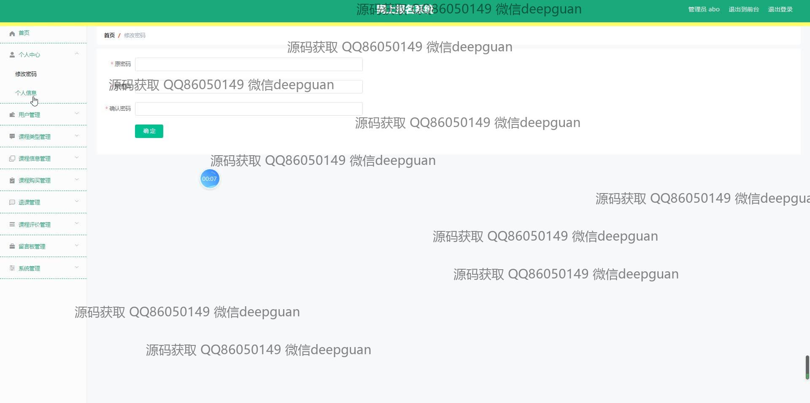
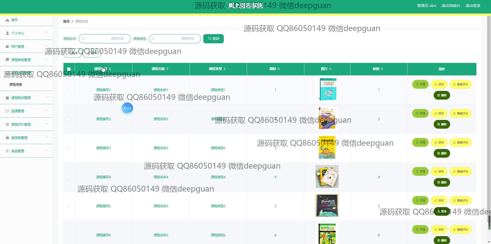
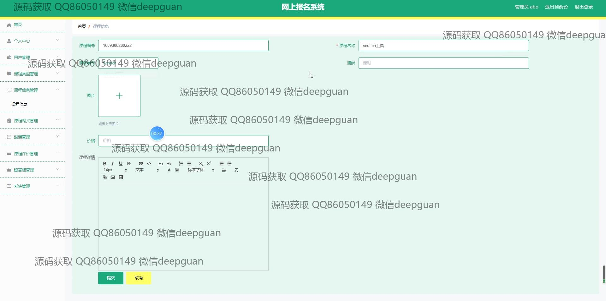
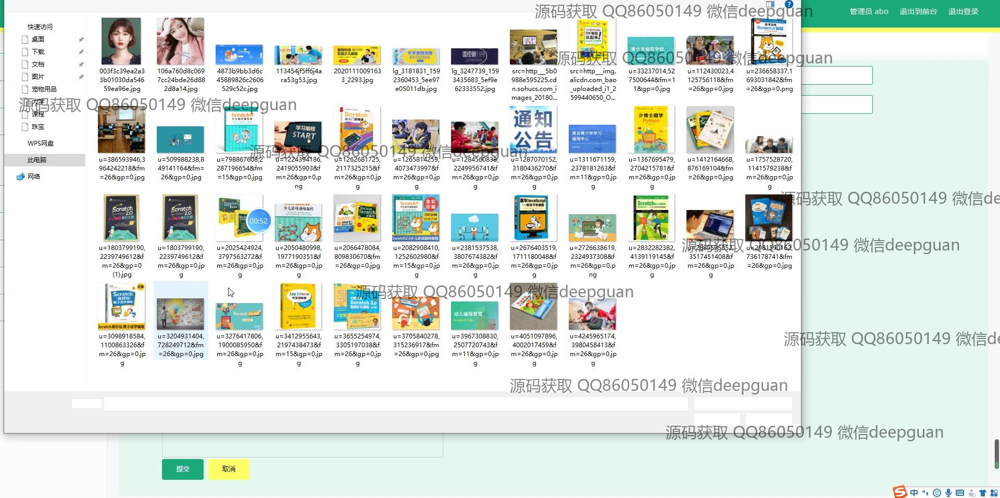
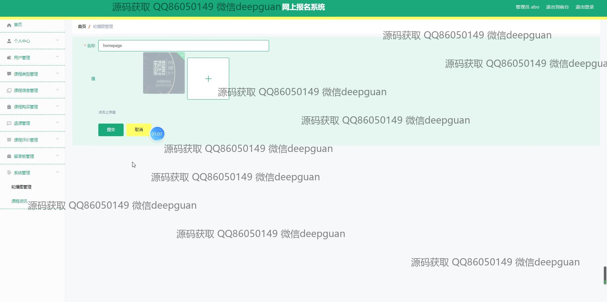
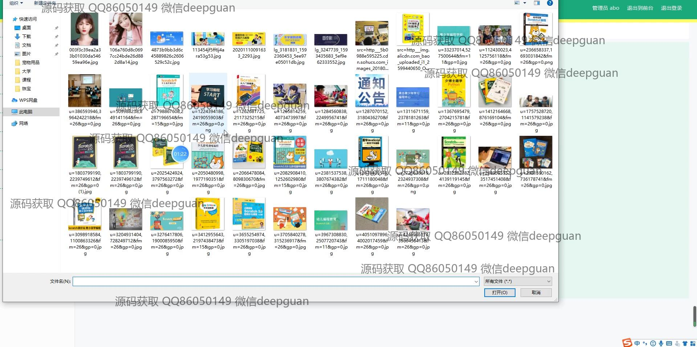

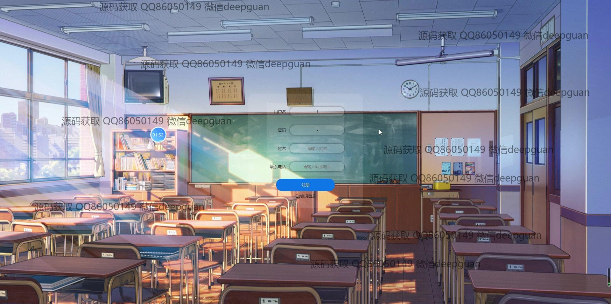

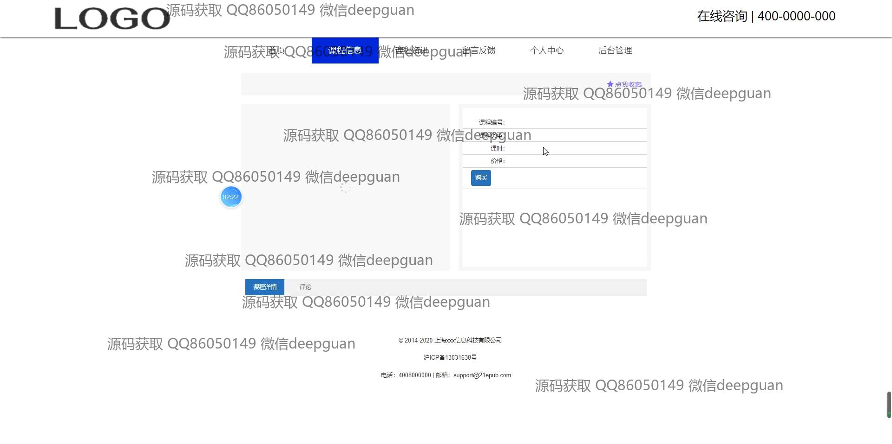
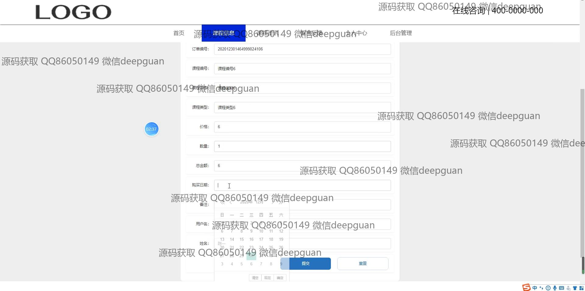
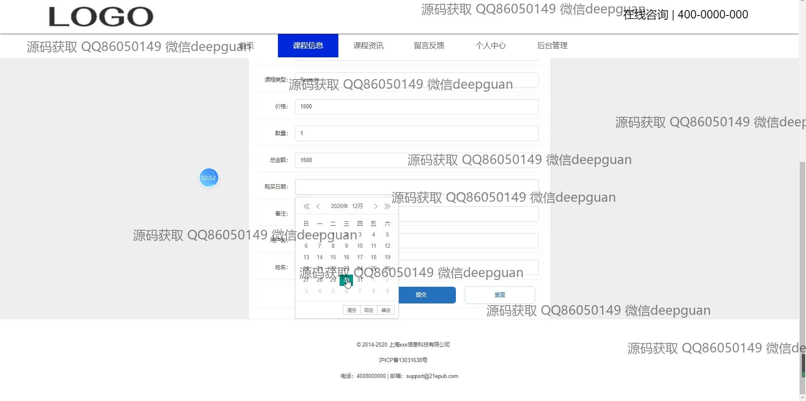

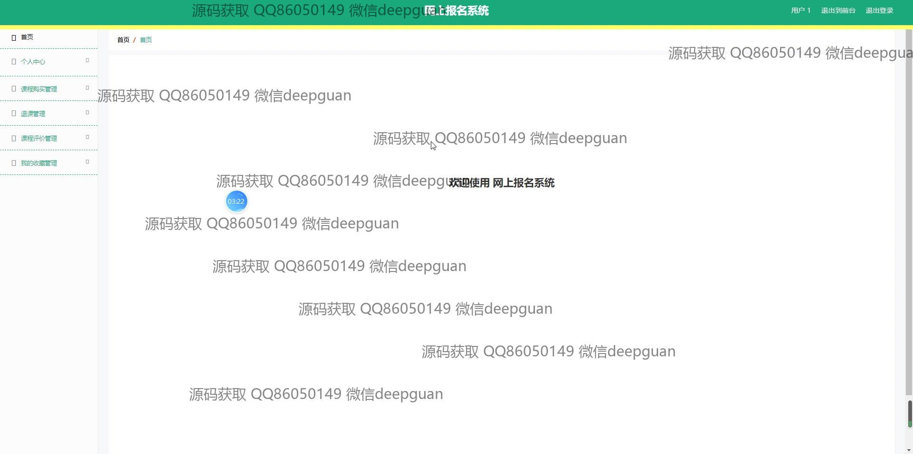
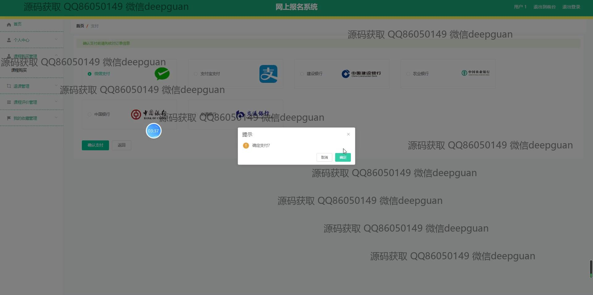
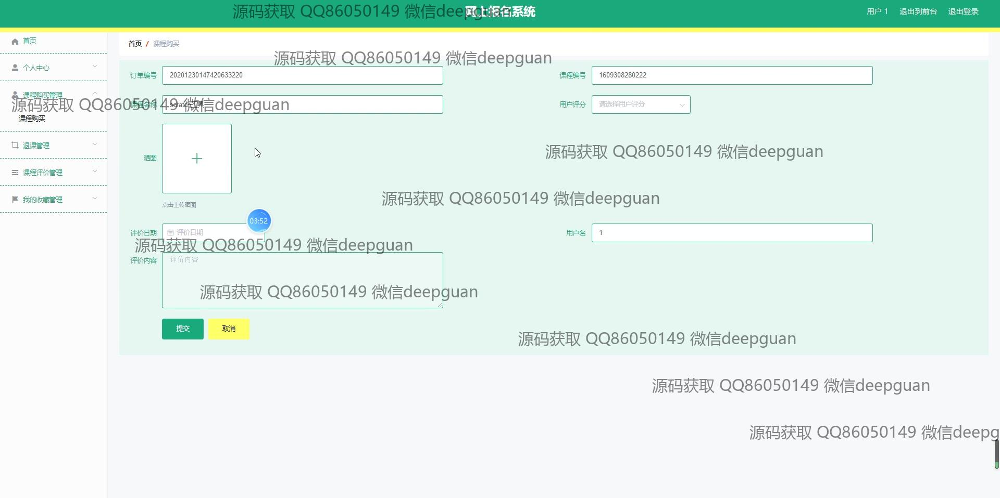
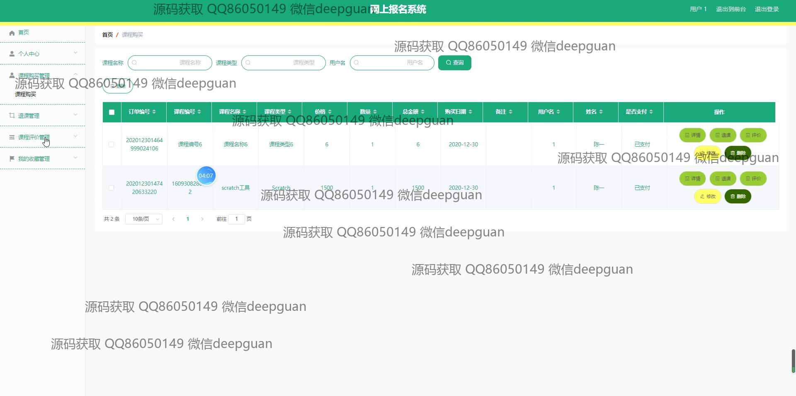
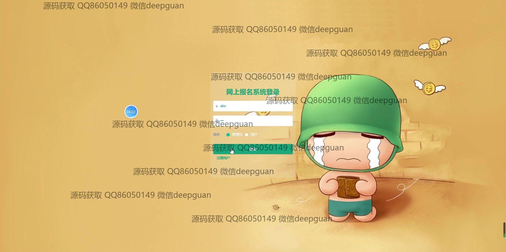
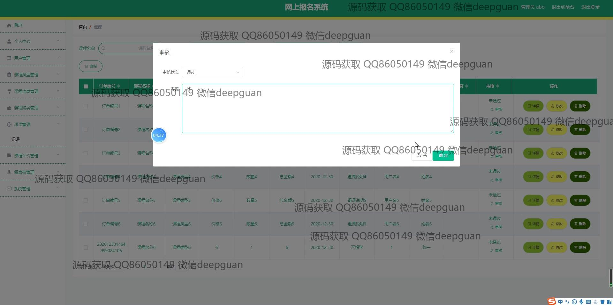
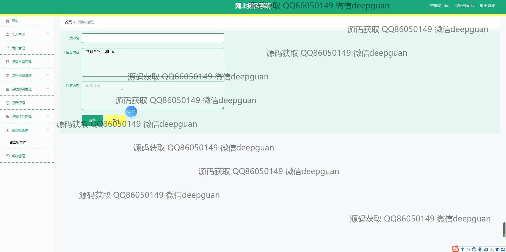
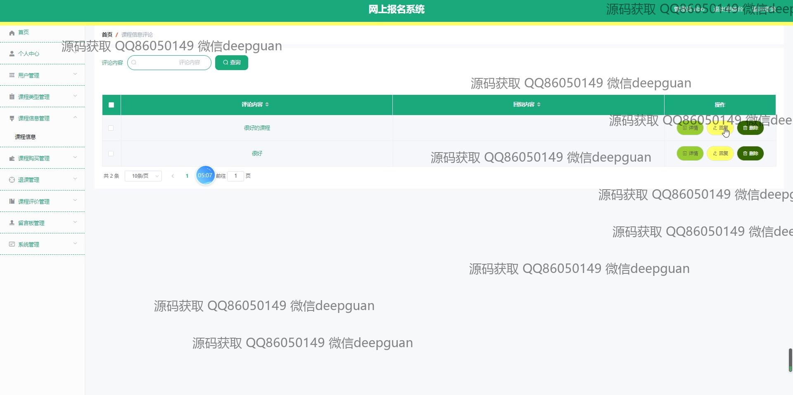
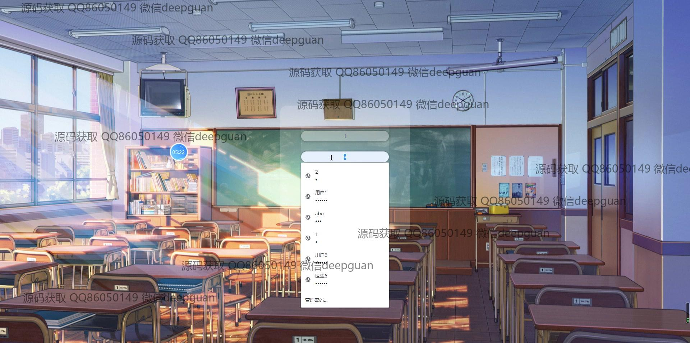
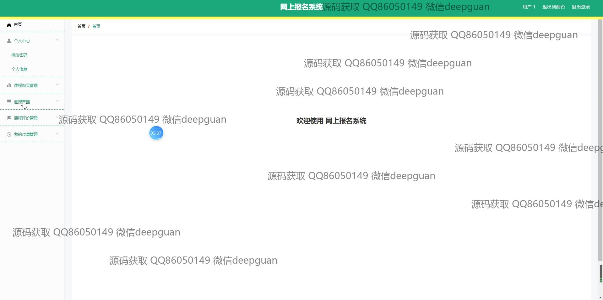

本代码来源于网络,仅供学习参考使用!

